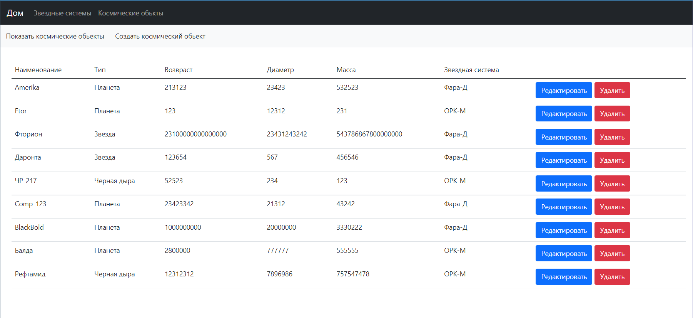
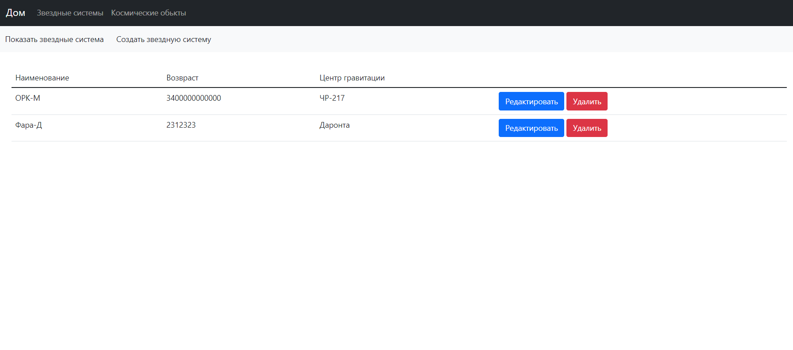
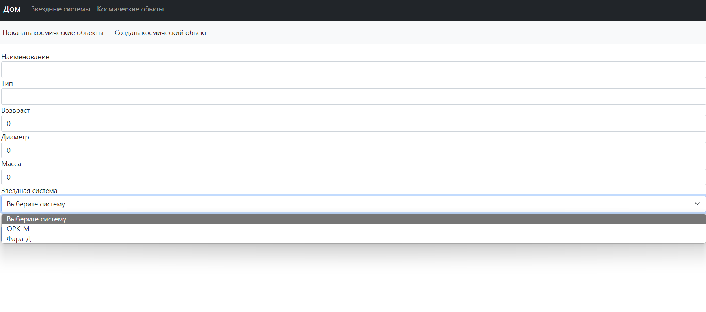
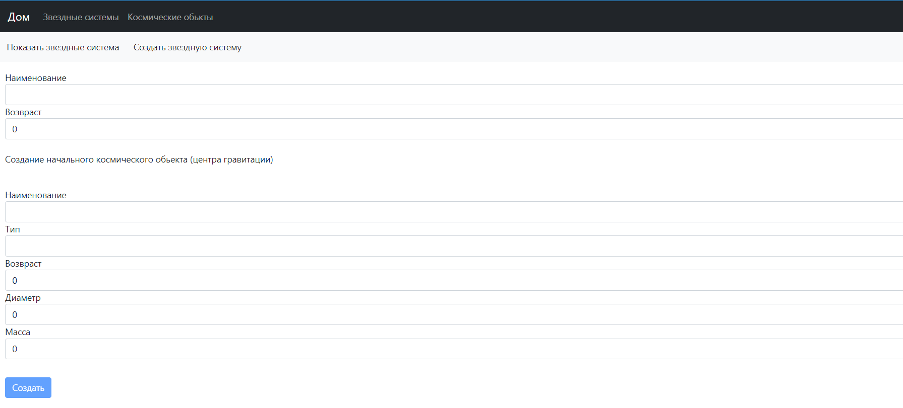
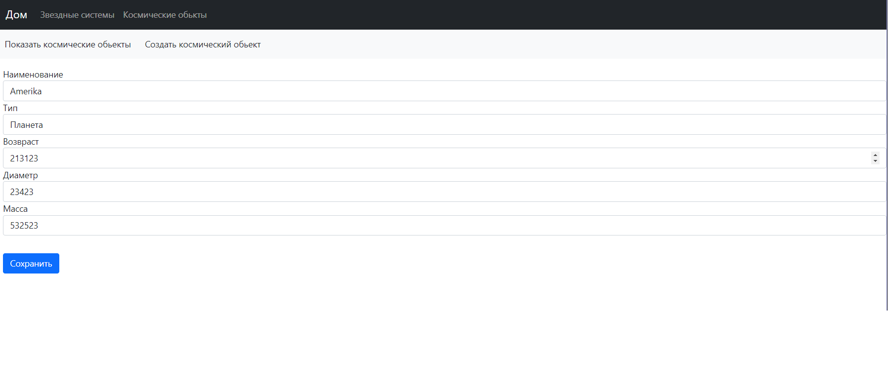
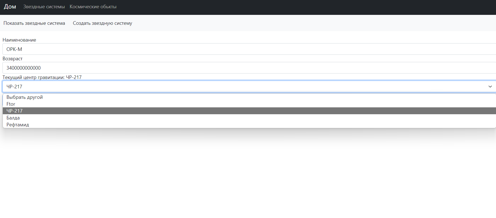

# StarSystemAccouting

Для Angular использовался Visual Studio Code. Для asp.net web api использовалась Visual Studio 2022 .NET6.
Список космических обьектов

Список звездных систем

Создание космических обьектов

Создание звездных систем

Редактирование космических обьектов

Редактирование звездных систем

